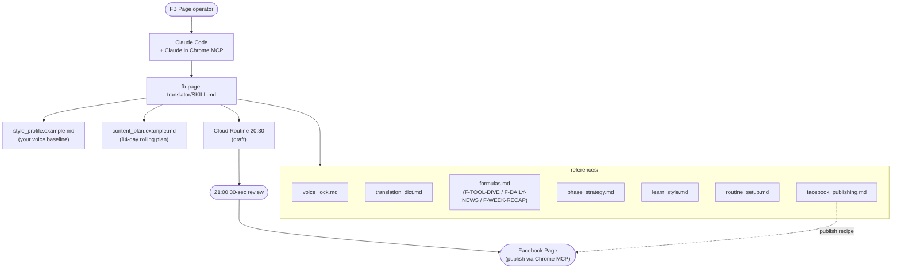

# fb-page-translator

> A Claude Code skill for B2B / thought-leadership FB Page operators — MBA-level strategic content in plain Chinese, no jargon, no viral creator hype.

**Author**: [@Lee-unhn](https://github.com/Lee-unhn) · a2264563@gmail.com

Inspired by and partially derived from [Hao0321/claude-skill-social-post](https://github.com/Hao0321/claude-skill-social-post). This skill diverges significantly in voice, schedule, and automation pattern.

## Overview

Most FB Page tooling falls into either viral-creator voice (殺瘋了 / 草 / emoji 滿屏) or MBA-consultant voice (NPI / TCO / PDCA / 結構性重塑). The first is wrong for B2B Pages targeting managers; the second kills readability and tanks completion rate. This skill is the **third path — the 「翻譯員」voice**: take the strategic intent (impact, cost, timing) but strip the jargon. Short sentences, concrete examples, hands-on credibility.

It ships a fixed 3-mode weekly schedule (tool deep-dives / daily news translation / Sunday weekly recap), a voice lock, a translation dictionary, and routine setup instructions for unattended publishing via Chrome MCP.

## Architecture



## Tech Stack

- [Claude Code](https://claude.com/claude-code) (macOS / Windows / Linux)
- [Claude in Chrome MCP](https://docs.claude.com/en/docs/claude-code/mcp) for browser-driven publishing
- Claude Routines / Scheduled Tasks for the 20:30 daily draft
- Markdown-only skill — no runtime, no dependencies; lives in `~/.claude/skills/`

## Core concept: 3-mode schedule

| Day | Formula | Word count | Theme |
|---|---|---|---|
| Mon / Wed / Fri | F-TOOL-DIVE | 350-400 | AI tool deep-dive (hands-on insight from your GitHub repos or recent tools) |
| Tue / Thu / Sat | F-DAILY-NEWS | 350-400 | Past 24-30h AI news, translated for managers |
| Sun | F-WEEK-RECAP | 800-1000 | This week's 5-7 AI happenings, weekly digest |

All posts at 21:00 local time. Cloud routine drafts at 20:30 → you confirm at 21:00 → auto-publish via Chrome MCP.

## Key Files

- `fb-page-translator/SKILL.md` — the skill entry point Claude Code reads
- `fb-page-translator/style_profile.example.md` — template for your voice baseline (fill with your own 10-20 past posts)
- `fb-page-translator/content_plan.example.md` — 14-day rolling content plan template
- `fb-page-translator/references/voice_lock.md` — voice constraints (no emoji walls, no MBA jargon, etc.)
- `fb-page-translator/references/formulas.md` — the three post formulas (TOOL-DIVE / DAILY-NEWS / WEEK-RECAP)
- `fb-page-translator/references/translation_dict.md` — jargon-to-plain-Chinese dictionary
- `fb-page-translator/references/routine_setup.md` — Claude routine + Chrome MCP wiring
- `fb-page-translator/references/facebook_publishing.md` — FB publishing recipe via Chrome MCP
- `docs/setup.md` — first-run setup walkthrough

## Usage

### Prerequisites

- [Claude Code](https://claude.com/claude-code) (macOS / Windows / Linux)
- [Claude in Chrome MCP](https://docs.claude.com/en/docs/claude-code/mcp) installed
- Chrome logged into the FB Page you want to publish to
- A claude.ai account with [Routines / Scheduled Tasks](https://claude.ai/code/routines) enabled
- Your Page should have **at least 10-20 public posts** OR you should be ready to bootstrap voice from scratch

### Install

```bash
# 1. clone
git clone https://github.com/<YOUR_GITHUB_USERNAME>/claude-skill-fb-page-translator.git

# 2. copy skill folder to Claude skills directory
# macOS / Linux:
cp -r claude-skill-fb-page-translator/fb-page-translator ~/.claude/skills/
# Windows (PowerShell):
Copy-Item -Recurse claude-skill-fb-page-translator\fb-page-translator $env:USERPROFILE\.claude\skills\
```

Then open Claude Code, customise `style_profile.example.md` with samples of your own writing, and follow `docs/setup.md` to wire up the cloud routine.

If you are trying to grow a personal creator profile with viral content, use [Hao's original `social-post`](https://github.com/Hao0321/claude-skill-social-post) instead.

## License

MIT — see [`LICENSE`](LICENSE).
